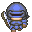

# MorelliZanotti2324 - Mas Princess


## Description 
This project aims to develop a simplified version of the game *Fat Princess*, where two teams of agents with different roles and specific abilities compete to rescue their princess while protecting their own, within a shared environment. 

The environment models base layouts, resource locations, and agent states (e.g., health, positions, and tasks) to facilitate strategic interactions. The overall gameplay is governed by fixed rules with the possibility of dynamic variations based on the game state, adding complexity and adaptability to the system.

Our work provides a platform to explore the dynamics of cooperation and competition in multi-agent systems: by assigning agents distinct roles and objectives, it enables the analysis of emergent behaviors and decision-making processes in controlled scenarios. This approach also facilitates a deeper understanding of role-based collaboration, studying how agents with complementary capabilities can work together to achieve shared goals.


## Features 
- **Implement Diverse Agent Roles**  
  Design agents with specialized roles and behaviors, including:
   - **Warriors**: Engage in short-range combat to protect their base and facilitate the rescue of their princess.
     
   - **Archers**: Provide long-range combat support during offensive and defensive operations.
     
   - **Priests**: Heal other agents to maintain team strength during battles.
     
  - **Gatherers**: Collect resources to repair defenses.
     

- **Explore Cooperation and Competition**
   - Investigate how agents interact and collaborate within teams to achieve shared objectives, such as protecting their princess or infiltrating the enemy base.
   - Analyze competitive dynamics as opposing teams vie for resources and strategic advantages.

- **Incorporate Adaptive Game Mechanics**
   - Implement fixed game rules with the potential for dynamic variations based on the game state, creating opportunities for strategic adaptation and complexity.

- **Assess MAS Technologies in Game-Like Environments**
   - Explore the capabilities of AgentSpeak(L) and Jason in modeling game-like mechanics, focusing on agent reasoning, decision-making, and emergent behavior.
   - Evaluate the effectiveness of multi-agent system (MAS) methodologies in handling dynamic, interactive environments typically managed by traditional game engines.


## Installation 
### Prerequisites

Before you begin, ensure you have the following software installed:

- **Java Development Kit (JDK)** >= 11
- **Gradle** >= 7.4.0
- **Git** >= 2.35.0

### Clone the Repository

#### GitLab
1. Clone the repository:
   ```sh
   git clone https://dvcs.apice.unibo.it/pika-lab/courses/ai-ethics/projects/morellizanotti2324.git
   ```
2. Navigate into the project directory:
   ```sh
   cd morellizanotti2324
   ```

#### GitHub
1. Clone the repository:
   ```sh
   git clone https://github.com/Flebio/MAS_Princess.git
   ```
2. Navigate into the project directory:
   ```sh
   cd code
   ```

### Running the Application

You can start the application using one of the following Gradle commands:

- Start the MAS simulation (using the last `.mas2j` configuration file):
   ```sh
   gradle runMas_PrincessMas
   ```
- Launch the configuration interface to customize the teams' composition and map size:
   ```sh
   gradle runConfigWindow
   ```

## Authors 
- Antonio Morelli - [antonio.morelli3@studio.unibo.it](mailto:antonio.morelli3@studio.unibo.it)
- Fabio Zanotti - [fabio.zanotti2@studio.unibo.it](mailto:fabio.zanotti2@studio.unibo.it)

## License 
This project is licensed under the MIT License.